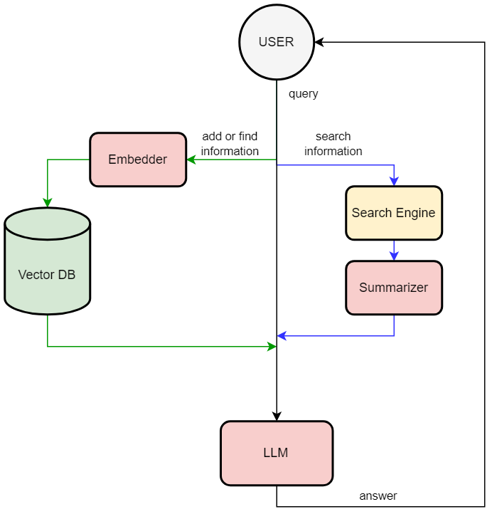

# long-term-memory-llm
LLM using long-term memory through vector database

## Description
This repository enables the language model to use long-term memory through a vector database. The application is built using [gpt4all nous-hermes-13b llm](https://gpt4all.io/index.html) and [chromadb](https://github.com/chroma-core/chroma).


### Current features:
- add new memory: type _`remem`_ before your query (add your query to vector db)
- query memory: type _`mem`_ before your query (query most relevant memory from db)
- web search: type _`web`_ before your query (search in google)

### Diagram:


### Example:
```
You > Hi
LOG: [Response]
Bot < Hello! How can I assist you today?
You > web who is Pavel Durov
LOG: [Searching]
Bot < According to the search results provided, Pavel Durov is a Russian entrepreneur who co-founded Telegram Messenger Inc. He was also involved in developing The Open Network (TON), but later withdrew from the project due to litigation with the US Securities and Exchange Commission (SEC).
You > mem who is Rustam Akimov
LOG: [Querying memory]
Bot < According to the input memories, your name is Rustam Akimov.
```

### Usage:
- Install requirements.txt
- Download [gpt4all nous-hermes-13b llm](https://gpt4all.io/index.html) 
- Get [Google API key](https://developers.google.com/webmaster-tools/search-console-api/v1/configure) and [Search Engine ID](https://programmablesearchengine.google.com/controlpanel/create)
- Specify variables in .env
- Run [chat.py](src/chat.py)
